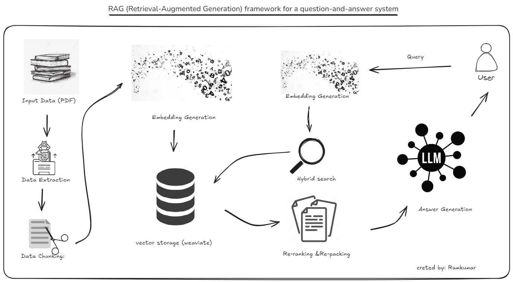

# PDF-Based Question and Answer System

High-level RAG (Retrieval-Augmented Generation) block diagram for a question and answer system using Weaviate as the vector database and the LLM Phi3 model. This system involves processing input data from a PDF, which is then extracted, chunked, and embedded using Phi3 before being queried to support answer generation:

## System Overview

### Input Data (PDF)

- **Description**: The system begins by processing PDF documents containing the source information.

### Data Extraction

- **PDF Processing**: Text is extracted from PDF documents.
- **Text Cleaning**: The extracted text is then cleaned to remove any non-relevant content and formatting.

### Data Chunking

- **Segmentation**: The clean text is segmented into manageable units such as paragraphs or sections for further processing.

### Embedding Generation

- **Model Usage**: Each text chunk is processed through the Phi3 large language model to generate embeddings.
- **Embedding Storage**: These embeddings are stored in Weaviate, a vector database optimized for quick and efficient similarity searches.

### Question Processing

- **Question Embedding**: Incoming questions are converted into embeddings using the same Phi3 model to ensure compatibility with chunk embeddings.

### Initial Retrieval

- **Hybrid Search**: Weaviate is queried with the question embedding to retrieve the most relevant text chunks based on embedding similarity.

### Re-ranking

- **Contextual Refinement**: Initially retrieved text chunks are further processed using detailed analysis and computationally expensive algorithms to refine their relevance.

### Re-packing

- **Optimizing Information Presentation**: The re-ranked results are reorganized to better suit user needs, which includes grouping related answers, highlighting key information, or adjusting the format based on the user's query and interaction history.

### Answer Generation

- **Contextual Integration**: The refined and repacked text chunks serve as the context for the Phi3 model to generate a coherent and contextually informed answer.

### Output

- **Delivery**: The generated answer is presented to the user, completing the query-response cycle.

## Getting Started

To set up this system locally, follow the steps outlined below:

### Prerequisites

Ensure you have the following installed:
- Python 3.8+
- Dependencies listed in `requirements.txt`

